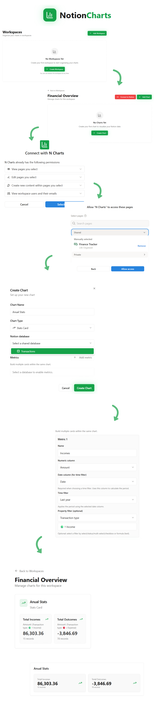

# 


A platform to visualize, analyze, and embed Notion data.

## Overview

NotionCharts connects to Notion databases to generate dynamic visualizations. The application enables users to authenticate their Notion workspace, configure custom charts based on database properties, and generate embeddable components for use in external websites or applications.

## Core Features

* **Notion Integration:** Authenticate and grant read-access to specific Notion pages and databases securely.
* **Workspace Organization:** Group and manage charts within dedicated workspaces to maintain structured data overviews.
* **Metric Configuration:**
  * Bind chart metrics directly to specific numeric columns within a Notion database.
  * Apply time filters utilizing date columns to calculate specific periods (e.g., "Last year").
  * Implement property filters to isolate exact data points (e.g., filtering by "Transaction type: Income").
* **Chart Types:** Construct multi-metric visual components, such as comprehensive Stats Cards.
* **Embed Functionality:** Export generated charts for embedding in external web environments.

## Usage Flow

1. **Workspace Creation:** Establish a workspace to organize related charts.
2. **Notion Authorization:** Connect the application to Notion and select the target databases for data retrieval.
3. **Chart Initialization:** Create a new chart and associate it with an authorized database.
4. **Metric Definition:** Configure individual metrics by selecting numeric values, date ranges, and applicable property filters.
5. **Visualization:** Render the configured charts, which maintain synchronization with the underlying Notion data.



## Getting Started

### Requirements

- Node.js LTS (18+ recommended) and npm
- Docker Desktop or Docker Engine with Docker Compose v2
- Notion OAuth credentials (optional, only needed for live Notion integration)

### Quick Start (Local)

1. Start Postgres and Redis:

```bash
docker compose up -d
```

2. Backend setup:

```bash
cd backend
npm install
```

Ensure [backend/.env](backend/.env) exists (copy from [backend/.env.example](backend/.env.example) if needed), then:

```bash
npx prisma migrate dev
npm run prisma:seed
npm run start:dev
```

3. Frontend setup (new terminal):

```bash
cd frontend
npm install
npm run dev
```

Update [frontend/.env](frontend/.env) with your local values before running the UI.

### Environment Variables

Backend (edit [backend/.env](backend/.env)):

- `DATABASE_URL`
- `REDIS_URL`
- `JWT_SECRET`, `JWT_REFRESH_SECRET`, `JWT_ACCESS_EXPIRES`, `JWT_REFRESH_EXPIRES`
- `CRYPTO_KEY`
- `NOTION_CLIENT_ID`, `NOTION_CLIENT_SECRET`, `NOTION_REDIRECT_URI`, `NOTION_API_VERSION`

Frontend (edit [frontend/.env](frontend/.env)):

- `VITE_API_BASE_URL` (default: `http://localhost:3000`)
- `VITE_NOTION_PROXY_URL` (default: `/api/notion`)
- `VITE_NOTION_CLIENT_ID`
- `VITE_NOTION_REDIRECT_URI`

### Ports

- API: `http://localhost:3000`
- Web: `http://localhost:5173`
- Postgres: `localhost:5432`
- Redis: `localhost:6379`

## Contributing

Issues and pull requests are welcome. Please:

- Keep changes focused and well-scoped
- Include clear descriptions and reproduction steps (for bugs)
- Run the relevant lint/tests before submitting

## Support

If you run into problems, open an issue with logs, steps to reproduce, and your environment details.

## License

This project is licensed under the MIT License. See [LICENSE](LICENSE).